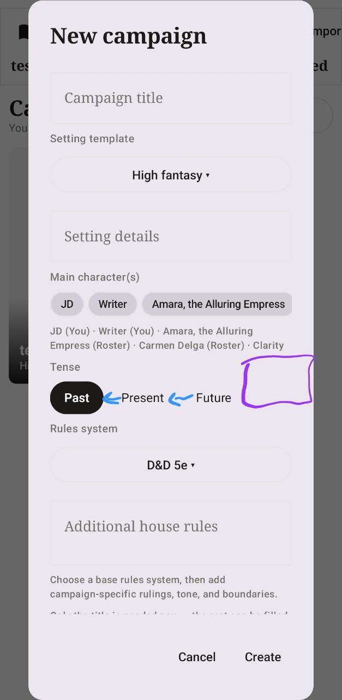
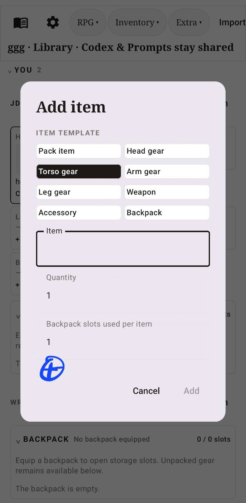
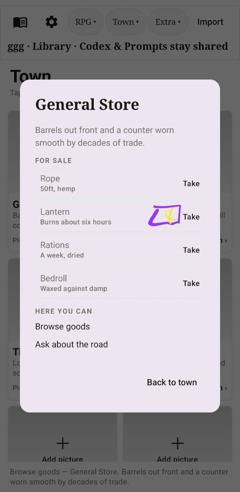

# Hard Checkpoint — v1.3.26 Prompt Templates and RPG Capture

**Checkpoint date:** 2026-08-29 
**Application:** Weaverse / WeaverVerse 
**Android package:** `com.ihy2ln.weaverse` 
**Version:** `1.3.26-beta` (`versionCode 72`) 
**Branch at checkpoint start:** `feature/storyboard-comic-pages` 
**Previous HEAD:** `6a9eca06176e2ea68a6b9c1e2d3690f11fb12a74` 
**Purpose:** preserve a complete recovery point after the RPG/Adventure capture work and the Prompting Instructions redesign.

## 1. What is preserved

This checkpoint preserves the complete editable source tree, Gradle wrapper,
Git history, project documentation, wiki pages, reference art, and the two most
recent installable APKs. Generated build output and superseded APKs are not
part of the durable checkpoint.

The application is a native Android writing and roleplaying workspace with:

- Novel planning, manuscript writing, scene generation, review, and reading.
- RPG campaigns with campaign setup, AI Dungeon Master play, rules-aware
  checks, roster capture, character sheets, inventories, equipment, towns,
  shops, and illustrated scenes.
- Character Chatting and Storyboard workspaces.
- Shared Codex, Notes, Prompt Collection, import/export, media, model selection,
  backup, and remote sync support.

For the broader module map, see [Architecture](ARCHITECTURE.md). For user-facing
operation, see the [Guide](GUIDE.md) and [Tutorial](wiki/Tutorial.md).

## 2. Prompting Instructions checkpoint

### 2.1 Final interaction model

The TEMPLATE card now has a strict hierarchy:

1. **Mode Template** is the base instruction source.
2. **Ecchi Mangaka Overlay**, **Genres**, and **Age Rating** are independent
   add-ons layered onto that base.
3. **Refresh instructions** rebuilds a read-only preview of the effective
   System prompt and opens the Instructions tab.

Mode Template offers one persisted selection:

| Mode | Backend effect |
| --- | --- |
| Novel | Scene-based novel prose, continuity, established POV/tense, no premature conclusion. |
| RPG | Game-master play, campaign rules, character sheets, inventory, consequences, player agency. |
| Chatting | Immediate in-character dialogue without controlling the other participant. |
| Storyboard | Sequential panel direction, composition, camera, blocking, expressions, lettering, and continuity. |

Genres are multi-select. The compact picker is exactly two rows tall and both
rows move inside one horizontal scroll container. The selected values become a
single deterministic `ADD-ON — GENRES:` instruction.

Age Rating provides five persisted choices:

| Rating | Prompt limits | Enables `{MATURE: ...}` blocks |
| --- | --- | --- |
| PG | Wholesome romance, mild violence, clean language, no sexual content. | No |
| PG-13 | Moderate action, stronger themes, suggestive romance, fade to black. | No |
| R | Strong language, intense violence, adult themes, nudity/sensuality; no explicit sex acts. | No |
| NC-17 | Explicit adults-only sexual content and graphic violence when requested. | Yes |
| X | Fully explicit adults-only sexual content and uncompromising adult detail when requested. | Yes |

All sexual content remains limited to unambiguous consenting adults.

### 2.2 Effective-instruction refresh

The refresh action does not overwrite the editable prompt. It snapshots the
current controls, resolves `{ECCHI: ...}` and `{MATURE: ...}` wrappers, combines
the global stack with the selected prompt's System messages, and shows the
result under **Instructions → Refreshed effective prompt**.

This makes removal verifiable:

- Turning the overlay off removes the hard-coded overlay and all `{ECCHI: ...}`
  content from the refreshed preview.
- Deselecting a genre removes it from `ADD-ON — GENRES:`.
- Changing rating replaces the age instruction and controls whether mature
  blocks survive.
- Changing mode replaces the first `[WEAVERSE TEMPLATE] MODE:` block.

The actual model request does not depend on the preview. Persisted controls are
also applied at the shared AI request boundary, so every provider and every
generation surface receives the current stack.

### 2.3 Idempotency and request routing

`PromptAddOns.applyTo` owns the global stack. It adds a
`[WEAVERSE TEMPLATE]` marker and refuses to add another stack when that marker
already exists. Earlier per-feature injection was removed from prompt
rendering, default guides, and RPG assembly. The final application happens in
both `stream` and `complete` requests inside `AiGenerationService`.

This fixes the earlier asymmetric behavior where RPG could receive duplicate
layers while another caller could omit them.

### 2.4 Persistence and migration

The Android DataStore keys are:

- `prompt_template_mode`
- `prompt_selected_genres`
- `prompt_age_rating`
- `prompt_ecchi_overlay`

Compatibility behavior:

- The former single `prompt_genre_label` is imported as a one-item genre set
  when no multi-select value exists.
- The former `prompt_mature_rating=true` becomes X.
- The former `prompt_mature_rating=false` becomes PG-13.

## 3. Prompt Collection structure

The seeded and editable folders are:

- **Novel:** Scene Beat, Adams Haven MW, Continue Writing, Expand Passage,
  Shorten, Extend, Scene Text Replacer, Summarizer, Describe Image, and
  Workshop Chat.
- **RPG:** Adventure Scene Beat, Roll Action, Scene Advance, Roster Capture,
  Loot & Inventory, and Adventure Recap.
- **Chatting:** Roleplay Reply, Continue Chat, and Out of Character Note.
- **Storyboard:** Storyboard Beat, Panel Direction, and Canvas Summary.
- **Prompt Components:** shared editable include blocks.
- **Custom:** user-created prompts and Wish Fulfilment Beat.

The active mode folder is moved to the top and labelled **ACTIVE TEMPLATE**.
The old Category entry field and checkmark were removed.

### Original UI feedback retained for history

The annotated screenshot below records the UI state that motivated the mode,
genre, rating, and category-control changes. It is historical evidence, not the
final layout.

## 4. RPG and Adventure state included in this checkpoint

The current worktree also includes the RPG improvements leading into this
checkpoint:

- AI-DM campaign startup and setup choices.
- Main-character multi-select, tense selection, setting templates, rules
  systems, and house rules.
- Rules-aware action classification and private roll resolution.
- Illustrated Adventure scene flow and numbered scene boundaries.
- Roster/loot extraction with a confirmation dialog before database writes.
- Character sheet, inventory, equipment slots, backpack capacity, item art,
  and town shop flows.
- Prompt Collection's RPG Adventure Scene Beat steering DM generation.

Reference screenshots retained with the docs:

| Campaign setup | Inventory creation | Town store |
| --- | --- | --- |
|  |  |  |

## 5. Important implementation files

| Responsibility | File |
| --- | --- |
| Global mode/rating/genre/overlay stack | [`PromptAddOns.kt`](../app/src/main/java/com/ihy2ln/weaverse/ai/prompt/PromptAddOns.kt) |
| Shared provider request boundary | [`AiGenerationService.kt`](../app/src/main/java/com/ihy2ln/weaverse/ai/AiGenerationService.kt) |
| Template UI and effective preview | [`PromptsScreen.kt`](../app/src/main/java/com/ihy2ln/weaverse/feature/prompts/PromptsScreen.kt) |
| Template state and refresh assembly | [`PromptsViewModel.kt`](../app/src/main/java/com/ihy2ln/weaverse/feature/prompts/PromptsViewModel.kt) |
| Persisted settings and compatibility | [`SettingsRepository.kt`](../app/src/main/java/com/ihy2ln/weaverse/data/settings/SettingsRepository.kt) |
| Template parser | [`PromptTemplateEngine.kt`](../app/src/main/java/com/ihy2ln/weaverse/ai/prompt/PromptTemplateEngine.kt) |
| Seeded mode prompt content | [`DefaultAiGuides.kt`](../app/src/main/java/com/ihy2ln/weaverse/ai/prompt/DefaultAiGuides.kt) |
| Prompt stack tests | [`PromptAddOnsTest.kt`](../app/src/test/java/com/ihy2ln/weaverse/ai/prompt/PromptAddOnsTest.kt) |

## 6. Verification record

Completed successfully on 2026-08-29:

- `:app:compileDebugKotlin`
- `:app:testDebugUnitTest --tests 'com.ihy2ln.weaverse.ai.prompt.*'`
- `:app:assembleRelease`
- `git diff --check` (line-ending notices only; no whitespace errors)
- APK manifest inspection with Android `aapt`

The focused prompt suite verifies:

- Overlay blocks are fully removed when disabled.
- Overlay blocks unwrap when enabled.
- Mature blocks follow the selected rating.
- Mode selection changes the base instructions.
- Multiple genres combine deterministically.
- Global stack application is idempotent.
- PG through X generate five distinct backend instructions.

The full Android suite previously completed 265 tests with three unrelated
failures in model-help text and difficulty-preset expectations. Those failures
are not in the prompt engine and remain follow-up work.

## 7. Installable artifacts

Only the two newest builds are retained in `Beta.Test.Build`:

| Build | Version code | SHA-256 |
| --- | ---: | --- |
| `weaverse-v1.3.26-beta-compact-prompt-controls-local.apk` | 72 | `33E8E8EFDD083BA61DED1A78900713EE0609E45ED44FC35DF771297F8DB9909F` |
| `weaverse-v1.3.25-beta-selectable-prompt-template-local.apk` | 71 | `29CBB139AB2B7C0B29B1D531FBF3FA0A9BB0B6C2323740832FA94907091FD3A2` |

The APKs use package `com.ihy2ln.weaverse`, minimum SDK 26, target SDK 34,
and compile SDK 35.

## 8. Recovery procedure

1. Open `S:\AI\Novel\Weaververse\src\Weaverse`.
2. Confirm the branch and checkpoint commit with `git status` and `git log -1`.
3. Use JDK 17 and Android SDK at the path recorded in `local.properties`.
4. Run `gradlew.bat :app:testDebugUnitTest --tests "com.ihy2ln.weaverse.ai.prompt.*" --offline`.
5. Run `gradlew.bat :app:assembleRelease --offline`.
6. Install the v1.3.26 APK from `Beta.Test.Build` for the last verified binary.
7. Read [Prompt Templates and Add-ons](wiki/Prompt-Templates-and-Add-Ons.md)
   before changing the global injection boundary.

Generated `build`, `.gradle`, `.kotlin`, and `tmp` directories may be recreated
by Gradle and are deliberately excluded from the durable checkpoint.

## 9. Rules for continuing safely

- Keep Mode Template singular; genres remain multi-select.
- Treat age rating and overlay as add-ons, not alternative modes.
- Do not store the effective preview back into editable prompt messages.
- Keep global stack application at one provider boundary.
- Preserve compatibility reads until users have migrated from v1.3.25.
- Add a focused test whenever a new global template layer is introduced.
- Increment `versionCode` for every installable checkpoint build.
