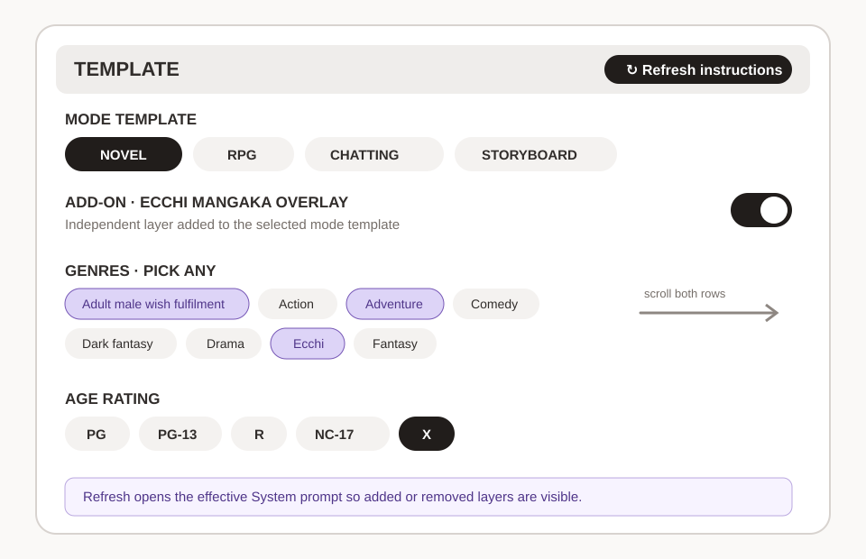

# Weaverse Wiki

Weaverse is an offline-first Android creative workspace for novels, tabletop
campaigns, WeaverSocial, manga/comic projects, and shared notes.

## Start here

- [Getting Started](Getting-Started.md)
- [Navigation and Shelves](Navigation-and-Shelves.md)
- [Appearance](Appearance.md)
- [Codex and Notes](Codex-and-Notes.md)
- [Novel and Reader](Novel-and-Reader.md)
- [RPG, WeaverSocial, and Manga Studio](RPG-WeaverSocial-and-Manga-Studio.md)
- [Manga Studio guide](Manga-Studio.md)
- [Prompts and AI](Prompts-and-AI.md)
- [Prompt Templates and Add-ons](Prompt-Templates-and-Add-Ons.md)
- [Backup, Sync, and Troubleshooting](Backup-Sync-and-Troubleshooting.md)

The Manga Studio hub first shipped in v1.4.9. The latest WeaverSocial and
Manga Studio hard checkpoint is [here](../CHECKPOINT-v1.4.54-WEAVERSOCIAL-MANGA-STUDIO.md).
The canonical single-page copy is [`docs/GUIDE.md`](../GUIDE.md).

## Five mode homes

| Main mode | Opens at | Purpose |
|---|---|---|
| Novel | Bookshelf | Choose or create novels |
| RPG | Campaign | Choose or create campaigns |
| WeaverSocial | Home | Social overview, focused feed, work servers, and character conversations |
| Manga Studio | Library | Browse manga/comic covers |
| Notes | Board | Open shared notes |

Everything except AI generation works offline. AI uses an OpenRouter key from
Settings. Export important work before uninstalling or clearing app data.

The WeaverSocial mode opens at Home, an all-in-one view of the social timeline,
stories, recent server chats, activity, and trends. Social is the focused feed
with pull-to-refresh and scroll-to-load-more.
