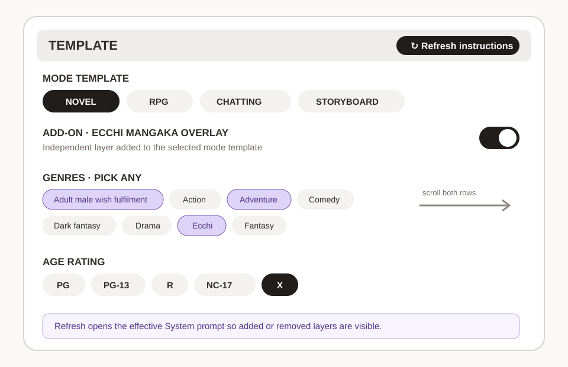
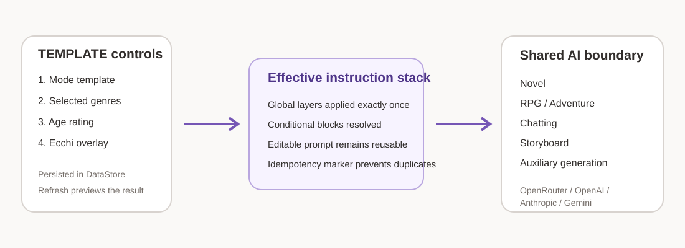
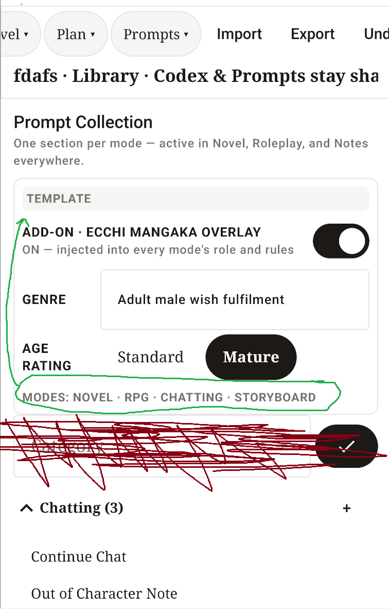

# Prompt Templates and Add-ons

> **Current checkpoint:** v1.3.26-beta · 2026-08-29<br>
> **Related:** [Tutorial](Tutorial.md) · [Architecture](../ARCHITECTURE.md) ·
> [Hard checkpoint](../CHECKPOINT-v1.3.26-PROMPT-TEMPLATES.md)

The Prompt Collection is Weaverse's editable instruction library. Its TEMPLATE
card controls the global instruction stack used by Novel, RPG, Chatting,
Storyboard, and auxiliary generation.



## At a glance

| Control | Selection type | What it changes |
| --- | --- | --- |
| Mode Template | Choose one | The base role and response structure the model follows. |
| Ecchi Mangaka Overlay | On/off | Adds or removes the identity, Adams Haven lore, and tonal layer. |
| Genres | Choose any | Adds one combined genre instruction in deterministic display order. |
| Age Rating | Choose one | Sets content limits and controls mature conditional blocks. |
| Refresh instructions | Action | Rebuilds and opens the effective System-prompt preview. |

## Mode Template

Mode Template appears first because it is the foundation, not an add-on.

- **Novel** writes polished scene prose in the established POV and tense.
- **RPG** acts as game master, respects rules and state, and protects player
  agency.
- **Chatting** answers in character inside the immediate exchange.
- **Storyboard** produces drawable sequential-panel direction.

Only one mode can be active. The choice persists between app launches. The
corresponding Prompt Collection folder moves to the top and displays
**ACTIVE TEMPLATE**.

## Genre picker

The genre picker is deliberately limited to two visible lines. Swipe sideways
anywhere in the two-row region to reach the remaining chips. Selected chips are
highlighted; tap again to remove them.

Any number of genres can be active, including none. The backend converts the
selection into one line:

```text
ADD-ON — GENRES: Adventure, Ecchi, Fantasy
```

The fixed ordering keeps previews, tests, and provider requests stable even
though Android DataStore stores the values as a set.

## Age ratings

| Rating | Intended content ceiling |
| --- | --- |
| **PG** | Mild action and wholesome romance; no sexual content. |
| **PG-13** | Moderate action and suggestive romance; intimacy fades to black. |
| **R** | Strong language, violence, adult themes, nudity, and sensuality without explicit sex acts. |
| **NC-17** | Explicit adults-only content and graphic violence when requested. |
| **X** | Fully explicit adults-only detail when requested. |

NC-17 and X enable `{MATURE: ...}` blocks. PG, PG-13, and R remove those
blocks. Every tier still requires sexual participants to be unambiguous
consenting adults.

## Overlay behavior

When **Ecchi Mangaka Overlay** is on, the effective stack includes its identity,
world-lore injection, and tonal rules. It also unwraps `{ECCHI: ...}` blocks in
editable templates.

When off:

- The global overlay block is omitted.
- Every `{ECCHI: ...}` wrapper and its contents are removed.
- Novel/RPG/Chatting/Storyboard base craft instructions remain active.

## Refresh instructions

After changing controls, tap **↻ Refresh instructions**. Weaverse opens the
Instructions tab and shows **Refreshed effective prompt** above the editable
message boxes.

Use this preview to verify that a layer was added or removed. It is read-only:
the editable base prompt is not overwritten, which prevents stale add-ons and
keeps templates reusable.

The preview is a visibility tool. Actual AI requests always use the persisted
current controls at the shared request boundary, even if Refresh was not tapped.



## Editing prompt messages

Each Prompt Collection entry may contain:

- **System** messages for instructions.
- **User** messages for a staged user turn.
- **AI** messages that prime the expected response voice or structure.

The General tab controls name, type, and default status. Advanced stores bias
and guidance. Description is human-facing explanatory text.

Conditional wrappers supported by the template engine include:

```text
{ECCHI: content included only while the overlay is on}
{MATURE: content included only for NC-17 or X}
```

The `{genre}` token resolves to the combined selected genres.

## Backend guarantees

The effective stack is finalized in one place before provider dispatch:

1. Read persisted controls.
2. Add the selected mode block.
3. Add genres when at least one is selected.
4. Add the selected rating block.
5. Add the overlay when enabled.
6. Resolve conditional wrappers in base System messages.
7. Send the stack through streaming or non-streaming generation.

The `[WEAVERSE TEMPLATE]` marker makes this operation idempotent. Nested
assemblers cannot add the stack twice.

## Migration from earlier betas

- A v1.3.24 free-text genre becomes a one-item genre set.
- v1.3.25 Mature becomes X.
- v1.3.25 Standard becomes PG-13.
- Existing editable prompt messages remain unchanged.

## Historical UI feedback

The following screenshot records the old v1.3.24 layout that had a large genre
field, a two-state age rating, an unselectable mode label, and an unnecessary
Category row. It is retained to explain why v1.3.26 changed the hierarchy.

[](images/prompt-template-v1.3.24-feedback.png)

## Troubleshooting

### A toggle changed but the preview did not

Tap **Refresh instructions**. The preview is an explicit snapshot and is
cleared whenever a control changes so it cannot masquerade as current output.

### The model still seems to follow the overlay after it was disabled

Refresh and search the effective prompt for `ECCHI MANGAKA`. If it is absent,
start a new generation so no earlier assistant response is being mistaken for
current System instructions.

### A mature block is missing at R

This is expected. `{MATURE: ...}` means explicit adults-only material and is
enabled only for NC-17 and X. R keeps adult themes but excludes explicit sex
acts.

### The genre row looks clipped

Swipe horizontally inside the two-line chip area. The section is intentionally
compact and does not expand vertically.

## Developer links

- [Global template stack](../../app/src/main/java/com/ihy2ln/weaverse/ai/prompt/PromptAddOns.kt)
- [Prompt Collection UI](../../app/src/main/java/com/ihy2ln/weaverse/feature/prompts/PromptsScreen.kt)
- [Prompt Collection state](../../app/src/main/java/com/ihy2ln/weaverse/feature/prompts/PromptsViewModel.kt)
- [Settings persistence](../../app/src/main/java/com/ihy2ln/weaverse/data/settings/SettingsRepository.kt)
- [Shared AI request service](../../app/src/main/java/com/ihy2ln/weaverse/ai/AiGenerationService.kt)
- [Prompt tests](../../app/src/test/java/com/ihy2ln/weaverse/ai/prompt/PromptAddOnsTest.kt)
